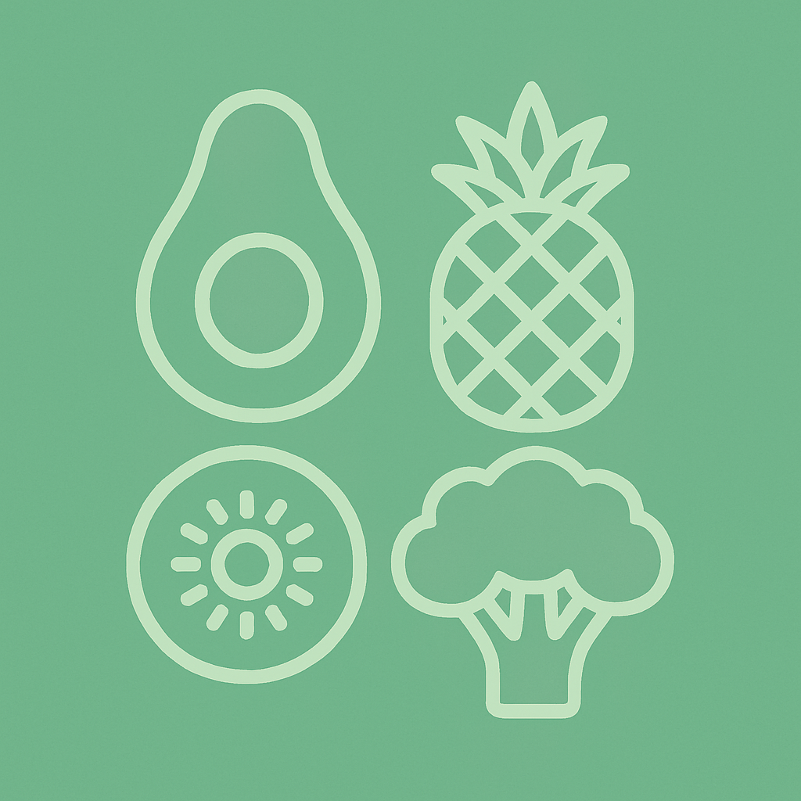

<table align="center">
  <tr>
    <td></td>
    <td><h1 style="font-size: 1.25em;">GreenPanier | A Simple Website</h1></td>
  </tr>
</table>

## Description

*GreenPanier* is a 30% mini-project for our **Dynamic Web Programming** subject.

It is a basic e-commerce website where users can browse vegetables and fruits, register, log in, and proceed to checkout.

The project runs locally using PHP and MySQL in XAMPP.

## Features

- User registration & login

- Product listing with images

- Simple payment form

- Admin Dashboard

## Technologies & Tools

- Frontend: HTML, CSS, JavaScript

- Backend: PHP

- Database: MySQL

- Local Testing: XAMPP

## Repository Colone

bash
git clone https://github.com/chaxyouxbraoui7/green-panier.git

> [!NOTE]
> 
> You can view the website at [GreenPanier](https://chaxyouxbraoui7.github.io/green-panier/) thanks to the GitHub pages feature (static only ~ HTML, CSS & JS, no backend)
>
> You can see the backend at <a href="a-documentation\README.md" target="_blank">Here</a>
>
> This Mini Project was inspired by this web site [Marché Express](https://marcheexpress.ma/)