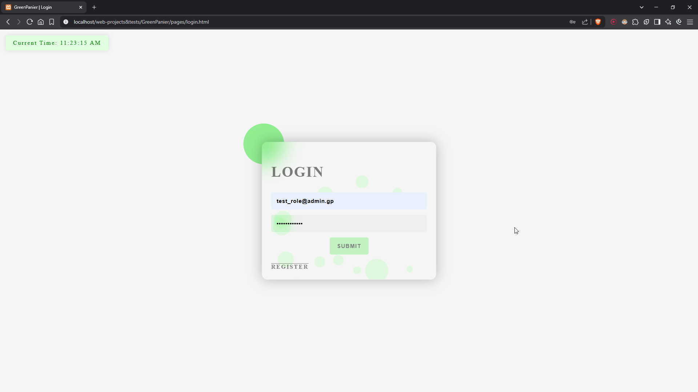

# GreenPanier Backend Documentation

## **The Database Tables | GreenPanier has a database name which is `greenpanier` and two tables which are `users` & `products`**

---

## **The Home Page of GreenPanier | Where the products are dynamiclly showed using JS**

---

## **Admin Dashboard**

### **The admin must login to add the products using `test_role@admin.gp` as an email and `adminx7xrole` as the password**

### **After adding the products the admin can update the name and the price or delete the product**

### **The products will be stored in the database, along side with the actions**

---

## **After adding the products and updating them the products will fetch with the help of the JS**

### **The user can now add the products to the cart**

---

## **The user then can press the cart icon to see the total price and pay**

### **After the submit a message will be toasted, telling the user if the payment has been succsefully done to lead him to the home page again after some sec**

---

## **The user also can register an account to log with it later | The infos will be stored in the database at the user table**

---

> [!NOTE]
>
> **And that's it!**